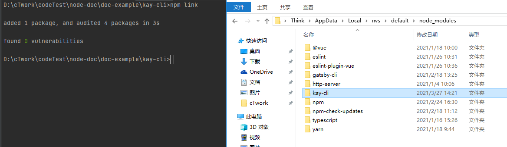
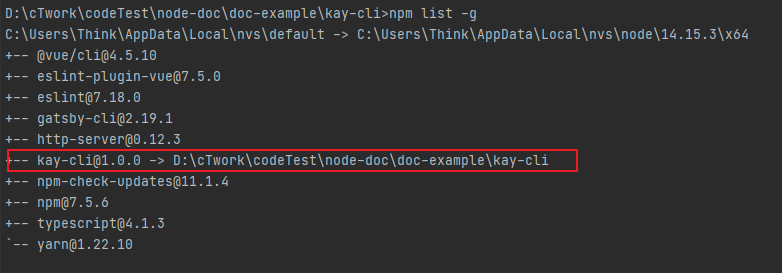
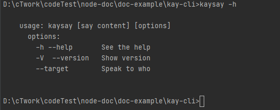
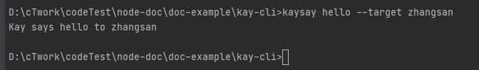

### 通过 node package.json 中 bin 来写一个 命令

写一个类似 [vue-cli](https://cli.vuejs.org/zh/) 和 [cowsay](https://github.com/piuccio/cowsay)

可以自己写一个命令， 可以运行可以这样在`shell`中运行:

```shell
kaysay hello
```

本地调试时 需要将一个 本地包 安装到全局

`npm install . -g` 或 `npm link`

即可在全局 node_modules 中看到,然后就可以运行 `kaysay` 命令了。


### 开始实现

项目结构：
```text
kay-cli
│ - package-lock.json
│ - package.json
│ - README.md
│
└ ─ bin
   |- cli.js
```

package.json 中配置 bin 字段。
```json
{
  "name": "kay-cli",
  "version": "1.0.0",
  "description": "kay say",
  "main": "index.js",
  "scripts": {},
  "bin": {
    "kaysay": "./bin/cli.js"
  },
  "author": "",
  "license": "ISC",
  "dependencies": {
    "yargs": "^17.0.0-candidate.8"
  }
}
```
解释 一下 配置的 bin 字段

意思是 执行命令 `kaysay` 就去项目中找 ./bin/cli.js

cli.js 的内容怎么写呢？ 见下
```javascript
#!/usr/bin/env node
const yargs = require('yargs/yargs');
const pkg = require('../package.json');
// const argv = yargs(hideBin(process.argv)).argv
const { argv } = yargs(process.argv);
// console.log('你说啥', argv);

const says = argv._[2];
if (argv.help || argv.h) {
  console.log(`
    usage: kaysay [say content] [options]
      options:
        -h --help       See the help
        -V  --version   Show version
        --target        Speak to who
  `);
} else if (argv.version || argv.V) {
  console.log(pkg.version);
} else if (argv.target && says) {
  console.log(`Kay says ${says} to ${argv.target}`);
} else if (says && !argv.target) {
  console.log(`Kay says ${says}`);
}
```
cli.js 的一行代码 `#!/usr/bin/env node` 代表我门要告诉系统下面的代码要通过 `node` 来执行。

那么我门在回过头来看，当在命令行中输入 `kaysay` 回车后，不是就相当与运行 `node ./bin/cli.js`了吗。

使用命令行少不了命令行传参,这里为了简单使用的 [yargs](https://github.com/yargs/yargs), 不用第三方库的实现可以到 [Node.js 从命令行接收参数
](http://nodejs.cn/learn/nodejs-accept-arguments-from-the-command-line)

到这里我门还没有完成, 还差一步骤,接下来我们要这边`npm`包打包成全局包。

必须要打成全局包才可以使用该命令,打成全局包的命令(项目根目录下):

`npm install . -g` 或 `npm link`

[npm中文文档](https://docs.npmjs.com/cli/v6/commands/npm-link)



运行完毕后全局的 `node_modules` 下会多出一个 `kay-cli`

可以运行一下 `npm list -g`查看

可以看出kay-cli 链接到了项目地址 
(这样就可以避免了频繁需要 `npm publish` 来调试本地代码了)

运行完毕后可以在命令行中输入：

`kaysay -h`



如果尝试运行了 `kaysay --help`


会发现和 `kaysay -h` 没有保持一致，这是因为 `yargs` 给我们拦截了, `--help` 被征用了，`yargs`希望我们通过定义的方式输出 命令帮助 [传送门](https://github.com/yargs/yargs/blob/master/docs/api.md#help)，而不是
直接写字符串打印。

可以参考：[cowsay](https://github.com/piuccio/cowsay/blob/master/cli.js)这个库的写法。
通过下面方式来实现：
```javascript
const yargs = require('yargs')
  .usage(`...`)
  .options({ ... })
  .describe({ ... })
  .boolean([ ... ])
  .help()
  .alias('h', 'help');
```

我们也可以关闭 `yargs` 对 `--help` 的默认开启

`const { argv } = yargs(process.argv).help(false); // 关闭 yargs 对 --help 的默认开启`

简单使用一下：

使 kay 对 张三 说 你好

`kaysay hello --target zhangsan`



到这里我就基本完成了。

如果你想让别人也能使用上就 `npm publish` 吧。

参考：
[node-npm发布包-package.json中bin的用法](https://blog.csdn.net/weixin_43833570/article/details/97100520)
[yargs](https://github.com/yargs/yargs)
[cowsay](https://github.com/piuccio/cowsay/blob/master/cli.js)
